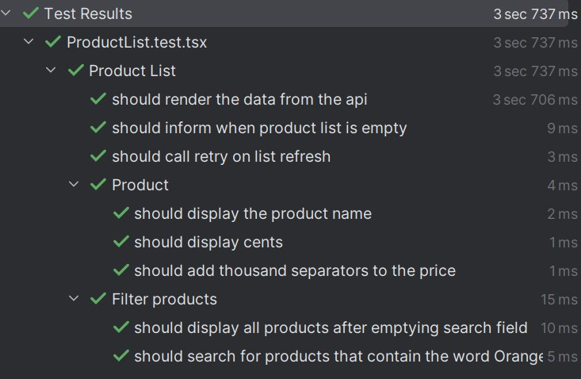

<style scoped>section { justify-content: start; }</style>

# Testing React Native


---

<!-- paginate: true -->

<style>
    section::after {
        padding: 20px;
        background: none;
        content: attr(data-marpit-pagination) '/' attr(data-marpit-pagination-total);
    }
</style>

---

## Motivation

- Code-Qualität
   - Stellt sicher, dass der Code funktioniert
- Zeitersparnis
    - Probleme können frühzeitig erkannt werden bevor sie zu größeren Problemen werden
- Dokumentation
    - Zeigen wie der Code verwendet werden sollte und welche Ergebnisse zu erwarten sind

---

## Testbarer Code

- Kleine und fokussierte Komponenten / Funktionen
- Pure Functions / Props verwenden
- Trennen von Logic und UI
- Test Driven Development


---

## Jest

- Eine Test-Laufzeitumgebung von Facebook
- Unterstützt Snapshot-Tests, Unit-Tests, Integrationstests und End-to-End-Tests
- Code Coverage
- Mocking
- Einfach zu konfigurieren und auszuführen


---

## Setup

Testframework Jest installieren

- jest
- @types/jest
- jest-expo

```
npm install jest @types/jest jest-expo --save-dev
```

jest.config.json
```json
{
    "preset": "jest-expo", // "react-native" ohne expo 
    "coverageReporters": [
      "html"
    ]
}
```

---

## Tests anlegen

Tests daneben
```
src/myComponent.ts
src/myComponent.test.ts
```

Tests daneben in einem Ordner
```
src/components/myComponent.ts
src/components/__tests__/myComponent.test.ts
```

Tests in eigenem Ordner
```
src/components/myComponent.ts
__tests__/components/myComponent.test.ts
```


---

## Tests schreiben


```js
it('should add thousands separators to integers', () => {
    const result = addThousandsSeparators('1234567890');
    const expected = '1,234,567,890';

    expect(result).toBe(expected);
});
```

```js
test('floats should not have thousands separators after the decimal point', () => {
    const result = addThousandsSeparators('12345.67890');
    const expected = '12,345.67890';

    expect(result).toBe(expected);
});
```

Ausführen
```
npm test
yarn test
```

---

## Matchers

```ts
expect(x).toBe(y); // Exakte Gleichheit
expect(x).toEqual(y); // Inhaltliche Gleichheit

expect(x).toBeUndefined();
expect(x).not.toBeUndefined(); // negieren mit not

expect(x).toBeTruthy();
expect(x).toBeGreatherThan(y);

expect(x).toContain(y);
expect(x).toThrow(myError);
```

---

## Async Tests

Async Funktion
```ts
it('should fetch something', async () => {
    const data = await fetchFromAPI();
    expect(data).toEqual(...);
});
```

Callback
```ts
it('should fetch something', done => {
    fetchFromAPI().then((data) => {
        expect(data).toEqual(...);
        done();
    });
})
```

---

## Gruppieren von Tests

<div style="display: grid; grid-template-columns: 1fr 1fr; gap: 1rem;">
<div>

```js
describe('Product List', () => {
    it('should render the data from the api');
    it('should inform when product list is empty');
    ...

    describe('Product', () => {
        it('should display the product name');
        ...
    });

    ...
});
```
</div>
    <div>
        
    </div>
</div>

---

## Component Tests Setup

* @testing-library/react-native
* @testing-library/jest-native (optional für zusätzliche Matcher)
* react-test-renderer
* @types/react-test-renderer

```
npm install --save-dev @testing-library/react-native @testing-library/jest-native react-test-renderer @types/react-test-renderer
```

Wenn @testing-library/jest-native genutzt wird:
jest.config.json
```json
{
    "setupFilesAfterEnv": ["@testing-library/jest-native/extend-expect"]
}
```

---

## Component Tests

- Interaktion
    - Testen wie der User mit der Komponente interagiert
    - Was ändert sich durch eine Interaktion (z.B. ein Button wurde gedrückt)
    - Nicht den State change an sich testen sondern was wird dem User präsentiert
- Rendering
    - Aussehen und positionierung von Elementen

---

## Einfacher Render Test

```tsx
const Product: React.FC<ProductProps> = ({ item }) => (
    <View style={styles.product}>
        <Text style={styles.productName}>{item.name}</Text>
        <Text style={styles.productPrice}>
            {addThousandsSeparators((item.price / 100).toString())}€
        </Text>
    </View>
);
```

```tsx
it('should add thousand separators to the price', () => {
    render(<Product item={{ id: '1', name: 'Foo', price: 234599 }} />);

    expect(screen.getByText('2,345.99€')).toBeOnTheScreen();
});
```

---

## Komplexer Render Test

### Snapshot Testing

- Konvertiert den gerenderten Output zu JSON
- JSON string wird in VCS mit aufgenommen
- Test vergleicht beide strings
- Für größeren Render Output

```ts
it('renders correctly', () => {
    const tree = renderer
        .create(<Product item={{ id: '1', name: 'Foo', price: 234599 }} />)
        .toJSON();
        
    expect(tree).toMatchSnapshot();
});
```

---

## Mocking

Erstellung eines Objektes, das den Funktionsumfang von realen Objekten nachahmt.

```ts
const {data: products, status, retry} = useFetch<ProductI[]>('https://api.example.com/products');
```

```tsx
import * as useFetch from './useFetch';

const mockedReturnData: ProductI[] = [
    { id: '1', name: 'Apple', price: 199 },
    { id: '2', name: 'Orange', price: 299 },
];

jest.spyOn(useFetch, 'default').mockReturnValueOnce({
    status: useFetch.FetchStatus.Successful,
    data: mockedReturnData,
    retry: () => {},
});

render(<ProductList />);
expect(screen.getByText('Apple')).toBeOnTheScreen();
```

---

## Interaktion

Vordefinierte Events
```ts
fireEvent.press(button);

fireEvent.changeText(input, 'new Text');

fireEvent.scroll(scrollView, {
  nativeEvent: {
    contentOffset: {
      y: 200,
    },
  },
});
```

Beliebige Events
```ts
fireEvent(button, 'pressIn');
fireEvent(button, 'longPress');
```

---

## Mocking und Interaktion

```tsx
import * as useFetch from './useFetch';

it('should be able to retry a failed api call', () => {
    const retry = jest.fn();

    jest.spyOn(useFetch, 'default').mockReturnValueOnce({
        status: useFetch.FetchStatus.Failed,
        retry,
    });

    render(<ProductList />);

    const retryButton = screen.getByText('Retry');
    expect(retryButton).toBeOnTheScreen();

    fireEvent.press(retryButton);
    expect(retry).toBeCalledTimes(1);
});
```

---

## Zusammenfassung

<div style="display: grid; grid-template-columns: 1fr 1fr; gap: 1rem;">
    <div>

### Tests schreiben
- Dateiname: `myComponent.test.ts`
- `test` / `it`
- Gruppieren: `describe`
- `expect().to...`

### Render Tests
- `render(<Component/>)`
- Snapshot für komplexen Output
    </div>
    <div>
### Mocking
Nachahmung des Funktionsumfangs realer Objekte: `jest.fn()`, `jest.spyOn()`

### Interaktion
- Button press: `fireEvent.press`
- TextInput: `fireEvent.changeText`
- Scroll: `fireEvent.scroll`
    </div>
</div>


---

## Quellen
### Webseiten:

Jest: [jestjs.io](https://jestjs.io)
Jest Native: [github.com/testing-library/jest-native](https://github.com/testing-library/jest-native)
React Native Testing Library: [callstack.github.io/react-native-testing-library/](https://callstack.github.io/react-native-testing-library/)
React Native: [reactnative.dev/docs/testing-overview](https://reactnative.dev/docs/testing-overview)